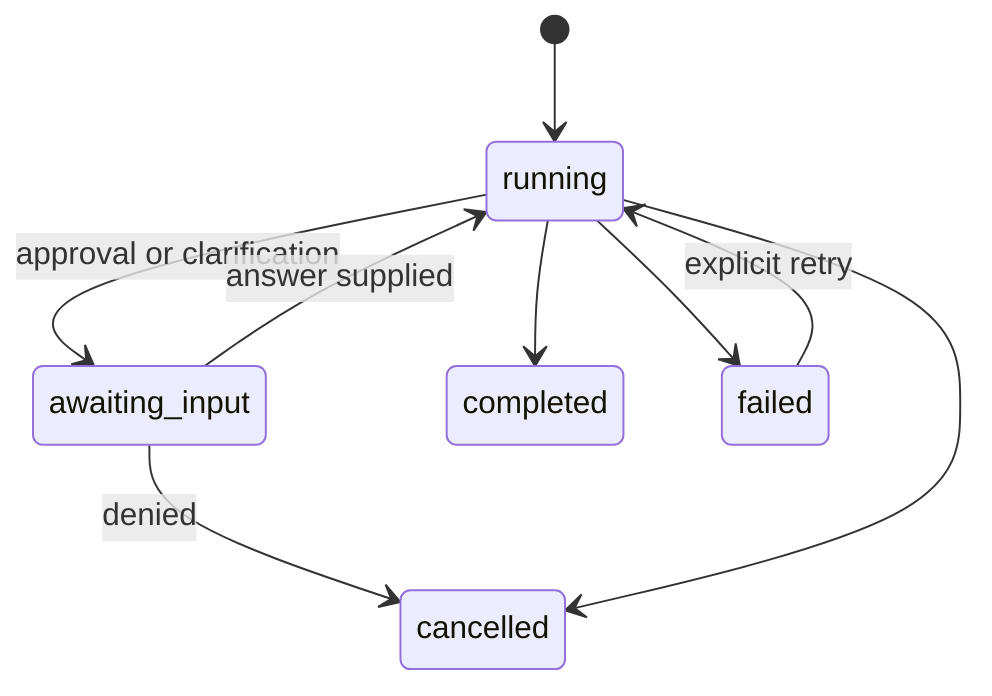
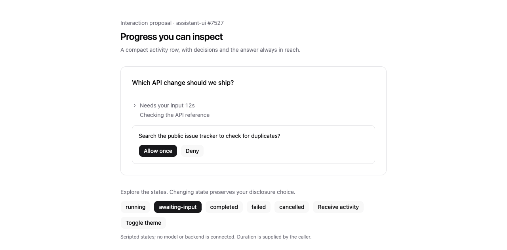
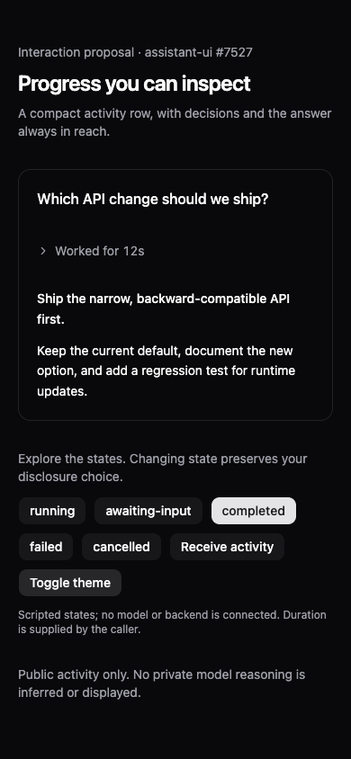

# Activity disclosure proposal for #7527

This is a working design prototype on a contributor branch, **not a shipped registry component or an approved public API**. It builds on the existing issue discussion and ToolTimeline/Collapsible conventions. The new piece is a small presentation boundary for a run's explicitly classified public activity.

## Interaction contract

| Before | After | Why |
| --- | --- | --- |
| Intermediate messages compete with the answer | Compact activity row; answer is a separate sibling | Preserve the outcome's hierarchy without losing inspectability |
| Approval can be folded into history | `attention` renders outside the disclosure | A required decision remains reachable while collapsed |
| Lifecycle updates can override disclosure state | Consumer owns `open`; status changes never toggle it | Preserve deliberate expansion, keyboard focus, and reading position |
| Elapsed time can restart when a component remounts | Caller formats persisted run timing | Refresh and virtualization do not invent a new duration |
| Every token can enter an announcement region | Only the state label is in `role="status"` | Avoid repeatedly interrupting screen-reader speech |



Disclosure state is independent of this lifecycle. Start each run collapsed, preserve the user's choice for the run's stable ID, and render the final answer outside the component. Completed, failed, cancelled, and awaiting-input labels remain distinct. The prototype contains scripted transitions, not a model/backend connection.

## Runtime integration boundary

Keep the external-store runtime as the source of conversation truth. The application adapter should supply a stable run ID, an explicit `activity | answer | attention` classification, lifecycle status, and server-persisted timing. These are **application metadata**, not fields proposed for assistant-ui's core API.

```tsx
// Values are projected by the application's external-store adapter.
<ActivityDisclosure
  status={run.status}
  statusLabel={labels[run.status]}
  durationLabel={formatPersistedDuration(run.startedAt, run.endedAt)}
  latestActivity={run.latestPublicActivity}
  open={expandedRunIds.has(run.id)}
  onOpenChange={(open) => setRunExpanded(run.id, open)}
  attention={<PendingDecisionOrRecovery run={run} />}
>
  <PublicActivityHistory entries={run.activity} />
</ActivityDisclosure>
<FinalAnswer message={run.answer} />
```

Do not infer the final answer from the last text chunk or expose private model reasoning. Do not start a mount-time stopwatch in each virtualized message. Timing/formatting and expansion persistence belong to the adapter/application. This example shows the composition boundary; it is not an implemented external-store adapter.

## Existing design system

The prototype imports the repository's Collapsible and Button primitives and its registry theme stylesheet. It uses existing semantic foreground, muted, border, ring, spacing, and radius tokens. There is no new font, color system, animation dependency, or runtime store. Both Base UI and Radix primitive implementations pass the same interaction tests. The disclosure has no height animation; its chevron transition is disabled by the existing reduced-motion utility.





## Run and verify

Use the repository's Node and pnpm versions. From the repository root:

```sh
pnpm install --filter @assistant-ui/ui... --filter @assistant-ui/shadcn-registry --frozen-lockfile
pnpm --filter @assistant-ui/ui exec vitest run --config ../../design-proposals/activity-disclosure/vitest.config.mjs --maxWorkers=1
pnpm exec tsc --noEmit -p design-proposals/activity-disclosure/tsconfig.json
pnpm dlx vite@8.3.0 --config design-proposals/activity-disclosure/vite.config.mjs
```

Open `http://127.0.0.1:5175`. The Vite runner is only for this contributor prototype; it is not a new workspace dependency or application proposal.

Verified locally on September 21, 2026:
- 18 tests passed: the same 9 cases with Base UI and Radix. Cases cover compact history, visible decisions/answer, manual expansion/collapse across streaming and completion, retained focus, failure/cancellation labels, restrained announcements, persisted duration input, and controlled callbacks.
- Scoped strict TypeScript, oxlint, and oxfmt.
- Chromium: Enter and Space toggle the disclosure; collapsed approval actions remain reachable; mobile 390 × 844 has no horizontal overflow; completed answer remains outside the collapsed region in dark mode.
- Reduced motion: `matchMedia('(prefers-reduced-motion: reduce)')` is true and the chevron's computed `transition-property` is `none`.

The mock run does not prove external-store projection, production scroll anchoring, interrupted-network persistence, or native screen-reader speech. Those need integration validation after maintainers choose the scope. The full monorepo/platform build was not run for this isolated presentation proposal.

## Decision for maintainers

Would a documentation recipe using this boundary be the right first increment, or should it become a registry element once the run metadata contract is established? The current branch deliberately leaves core API, registry manifests, runtime grouping, and published packages untouched.
